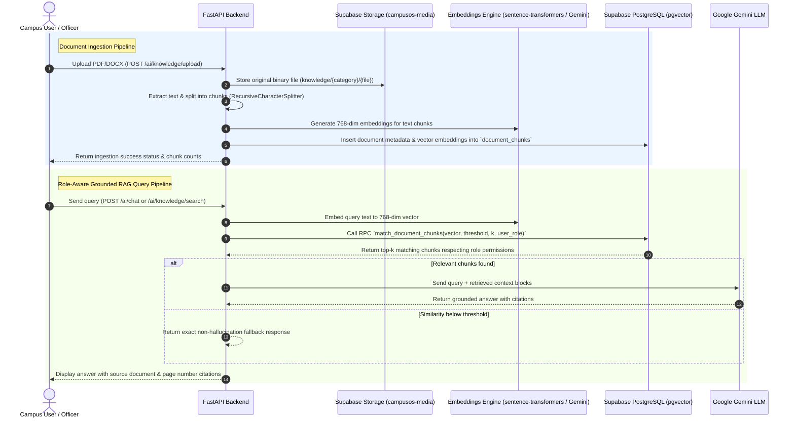

# CampusOS AI – Production RAG System Architecture

Visual system architecture for the persistent **Supabase PostgreSQL + pgvector** Retrieval-Augmented Generation (RAG) pipeline in CampusOS AI.

## 📊 End-to-End Ingestion & Query Flow

## 🔒 Security & Access Matrix

| Role | Access Permissions |
| :--- | :--- |
| `student` | Student success guides, course documents, general campus knowledge |
| `faculty` | Faculty policies, course management, academic research documents |
| `placement_officer` | Placement drives, recruiter statistics, student resume bank |
| `hostel_warden` | Hostel rules, occupancy guidelines, leave policies |
| `admin` / `super_admin` | Universal access to all knowledge bases & administrative documents |
